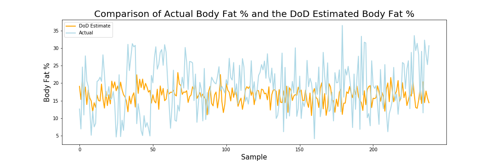

# Prediction Model for Total Body Fat in Adult Men

Utilizing data recorded on 252 adult men to create an algorithm that can more accurately predict total body fat percentage in an adult male

!.[.](waist_pic.jpg)

## Problem

Knowing one's total proportion of body fat is beneficial both from a health standpoint as well as a cosmetic standpoint. The two most accurate forms of this measurement are through use of a DEXA scanner and/or hydrostatic weighing. Both of those processes are expense and time consuming for the average individual. By using information about patients that have performed those tests, we may be able to find a commonality among these variables that will assist us in making a more affordable and accessible, but still fairly accurate, estimation of a persons body fat percentage. Current algorithms based on easily accessed data are considered only slightly accurate across the population as a whole, but wildly inaccurate to an individual. 
     
## Introduction

The data set acquired is taken from 252 adult male samples. That being said, any predictions created from it, will likely only apply to the adult male population. I believe it potentially important to create separate models based on gender, and possibly other unforeseen factors to arrive at an estimation of the desired accuracy based on the individual rather than across the population. Each sample in this set has had their total body fat measured through hydrostatic weighing. Density is the resulting column (X*X). With that value it has been plugged into two separate formulas to calculate the proportion (Siri & Brozek) Brozek has shown to be more accurate used on samples that have not had any recent weight fluctuations.

(I will be using the Brozek Formula, after reviewing the data, Siri dipped into the negatives)

## The Current Error of the Standard DoD Measurement

The current error of the standard method stands at an average of 7.22 off of the actual body fat percentage.

## Methods Tested

1. Linear, Ridge, and Lasso Regression

2. Random Forest Regressor

3. XgB Regressor

## Solution

Both of the Lasso and Ridge Regression models held a similiar accuracy rate of predicting the Error of the standard measurement.

They had an average error rate of 4.12 and 4.11.

Thus (Standard Bodyfat Estimate) - (Model Predicted Error) = (The more accurate Bodyfat Estimate)